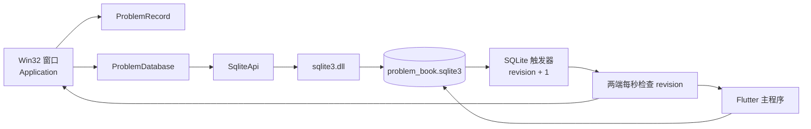
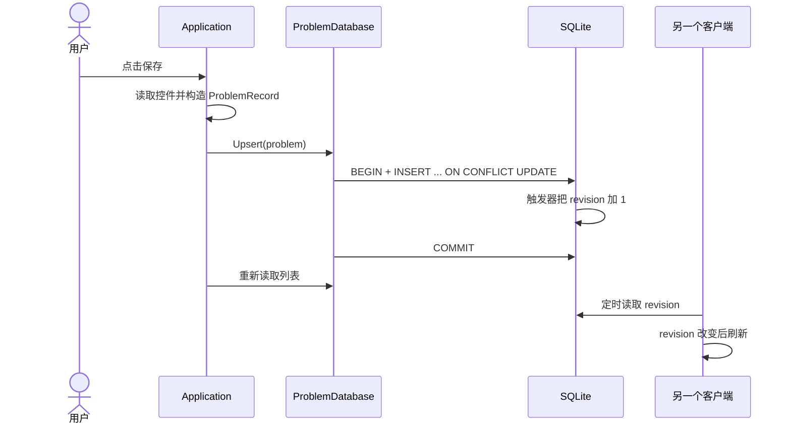

# C++ 题库小程序架构

这份文档从学习者视角解释 `oj_problem_companion.exe` 如何启动、读写题库，
以及它怎样与 Flutter 主程序共享同一份数据。

## 1. 设计目标

这个子程序刻意保持“小而专一”：它只负责快速查看、录入、修改和删除题目，
不重复实现主程序的训练、备份等完整功能。界面使用 Win32 API，数据通过 SQLite
共享，因此不需要把 Flutter 引擎打包进来，启动和常驻内存都更轻。

架构中最重要的边界是：

- Flutter 主程序拥有数据库结构，负责首次迁移和未来的 schema 升级；
- Flutter 与 C++ 都可以修改题目行；
- C++ 只接受已知的 schema 版本，不自行“猜测”或升级表结构；
- 两个程序都用单行 upsert/delete，避免整表覆盖对方刚写入的数据。

## 2. 总体结构

它是一个简单的三层结构：

| 层 | 主要文件 | 职责 |
| --- | --- | --- |
| 表现层 | `src/main.cpp` | 创建窗口和控件，响应按钮、列表、定时器事件 |
| 数据访问层 | `src/problem_database.*` | 把题目对象转换成 SQL，管理事务并校验 schema |
| SQLite 适配层 | `src/sqlite_api.*` | 动态加载 `sqlite3.dll`，解析函数并处理 UTF-8/UTF-16 |

资源和测试不属于运行时分层：

- `resources/app.rc` 把多尺寸猪猪图标编译进 EXE；
- `tests/problem_database_test.cpp` 用隔离数据库验证数据契约；
- `build.ps1` 负责查找工具、复制 `sqlite3.dll`、构建和测试。

## 3. 启动过程

入口是 `wWinMain`，启动顺序如下：

1. 初始化 COM 和 Windows 通用控件。
2. 解析 `--database`。没有传参时使用应用数据目录中的默认题库。
3. 如果默认数据库还不存在，寻找同目录的 Flutter 客户端，请它运行一次无界面迁移。
4. 构造 `ProblemDatabase`，打开 SQLite 并验证 `PRAGMA user_version == 2`。
5. 注册窗口类；这里也会从 EXE 资源加载猪猪大图标和小图标。
6. 创建控件，读取题目列表，并启动一秒一次的刷新定时器。
7. 进入 Windows 消息循环，直到窗口关闭。

自定义 `--database` 路径是一个安全例外：如果文件缺失或结构不完整，程序会拒绝
写入，而不会擅自创建一个看似可用、实际不兼容的库。

## 4. 一次保存是怎样发生的

`ProblemRecord` 是 UI 与数据库之间的普通数据对象。界面不直接拼 SQL；
`ProblemDatabase` 通过预编译语句绑定字段，并在事务中提交。删除走同样的路径，
只是调用 `Delete(id)`。

## 5. 为什么能与 Flutter 同时工作

SQLite 使用 WAL 模式和 busy timeout。WAL 允许读操作与写操作更好地并行；
busy timeout 则让短暂的写锁竞争先等待，而不是立即报错。

数据库里的触发器会在 insert、update、delete 后自动递增
`problem_change_state.revision`。两个客户端每秒只读取这个很小的整数；只有发现变化
时才重新加载题目，因此不需要进程间消息，也不会每秒重读整张表。

这是一种“最终在一秒内同步”的设计，并不是实时协同编辑。如果两个程序同时编辑
同一条题目，最后提交的那次保存会覆盖该行较早的版本；但编辑不同题目时不会互相
覆盖整张表。

## 6. 资源与生命周期

代码用 RAII 管理资源：

- `SqliteApi` 析构时释放动态库模块；
- `ProblemDatabase` 析构时关闭数据库连接；
- 内部 `Statement` 析构时 finalize 预编译语句；
- 窗口句柄由 Windows 在窗口销毁时回收；
- 启动迁移进程后，代码显式关闭进程和线程句柄。

类禁止复制，是为了避免两个对象误以为自己同时拥有同一个数据库句柄或 DLL 模块。

## 7. 当前取舍与演进方向

目前 `Application` 和少量字符串/日期辅助函数都在 `main.cpp`。对这个规模来说，
单文件能减少跳转，方便初学者沿消息循环阅读；如果界面继续增长，可以按下面顺序拆分：

1. 把纯转换函数（标签 JSON、日期、ID）移到 `problem_format.*`，先为它们加单元测试；
2. 把控件创建和布局移到 `problem_window.*`；
3. 引入不依赖 HWND 的 `ProblemEditorController`，让保存/删除逻辑可测试；
4. 若需要真正的同题协同编辑，再加入 `updated_at` 乐观锁，而不是提高轮询频率。

无论如何拆分，都应保持 `ProblemDatabase` 这条边界：UI 只传 `ProblemRecord`，
数据库层负责 SQL、事务和兼容性校验。

## 8. 建议的阅读顺序

第一次学习这部分代码，可以按以下顺序：

1. `problem_database.hpp`：先认识数据对象和公开接口；
2. `tests/problem_database_test.cpp`：从预期行为理解数据库契约；
3. `problem_database.cpp`：观察事务、绑定参数和 RAII；
4. `sqlite_api.cpp`：理解为什么程序能不链接静态 SQLite 库；
5. `main.cpp` 的 `wWinMain`、`HandleMessage`、`SaveEditor`：串起完整运行流程；
6. `CMakeLists.txt` 和 `build.ps1`：最后理解程序如何被构建和打包。
